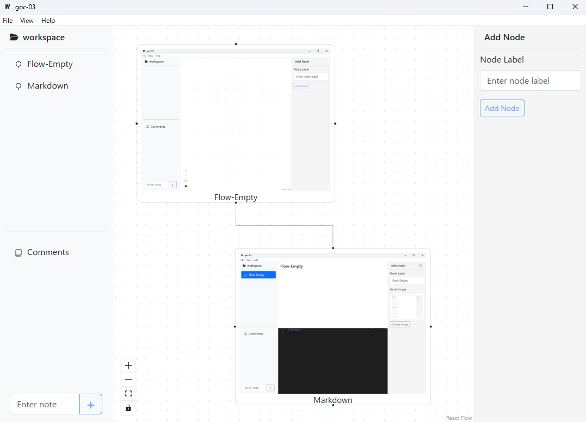
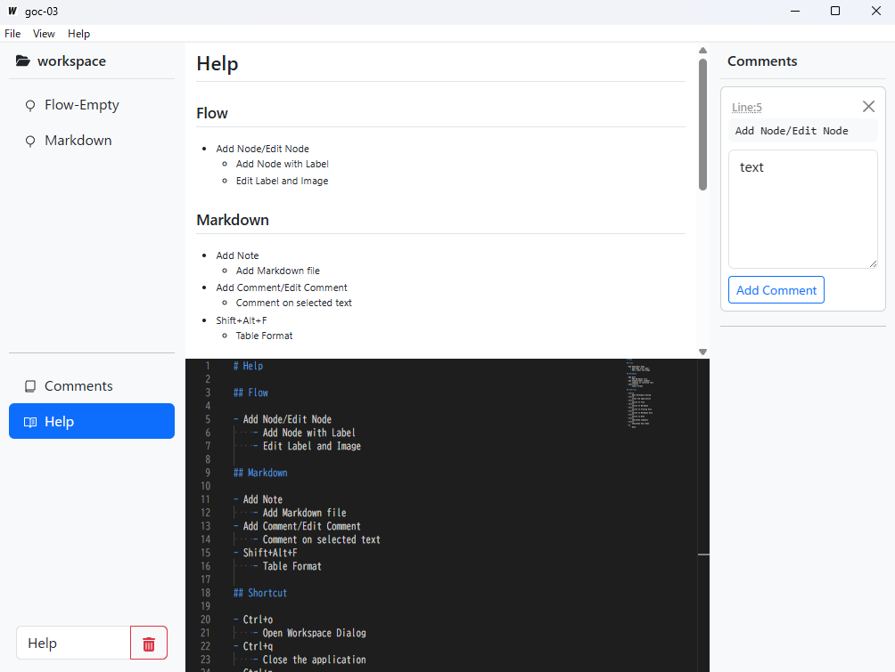

# README

## TODO

- react-flow history
    - wip
- node resizer
    - wip
- node type change
- image copy and paste
- node/comment id => uuid?
- components resize
    - wip
    - todo: window size over
    - todo: divider component
- monaco-editor localize
- image remove
- flow page : node pair md exists icon
    - wip
    - todo: mouse over markdown preview
- manual save mode
- monaco-editor cursor confusion
    - wip

## Inspiration

This project was inspired by:
- [ryo-manba/md-review](https://github.com/ryo-manba/md-review)
